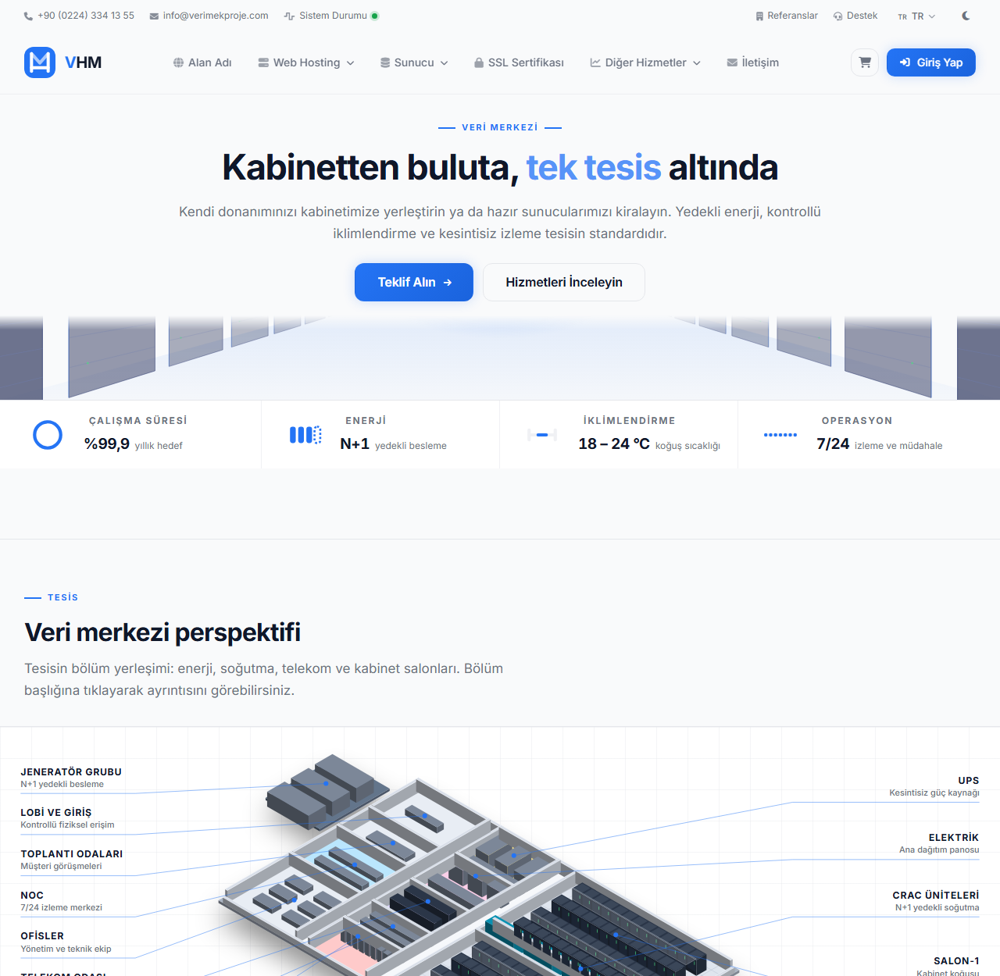
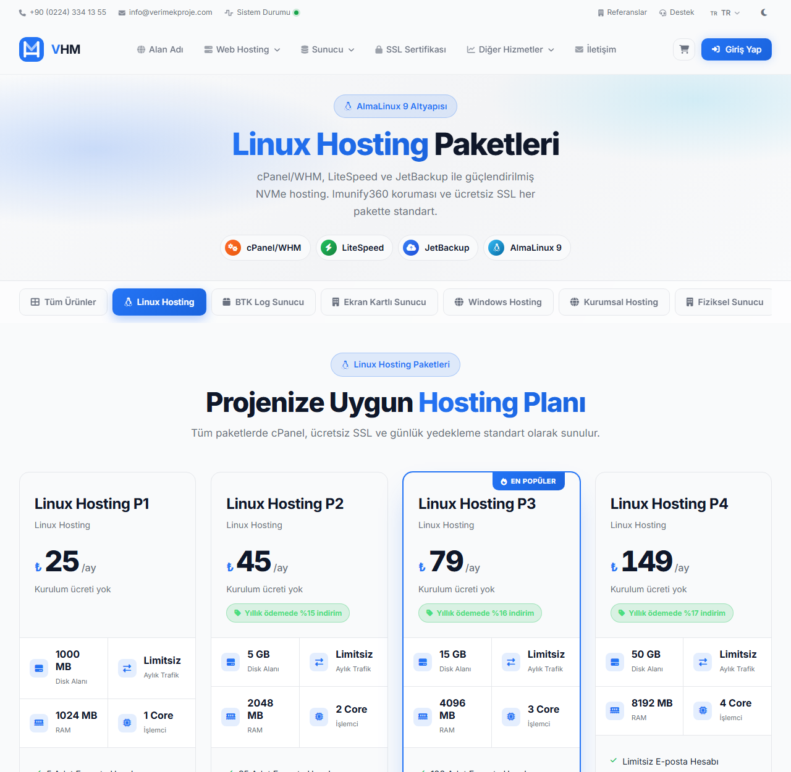
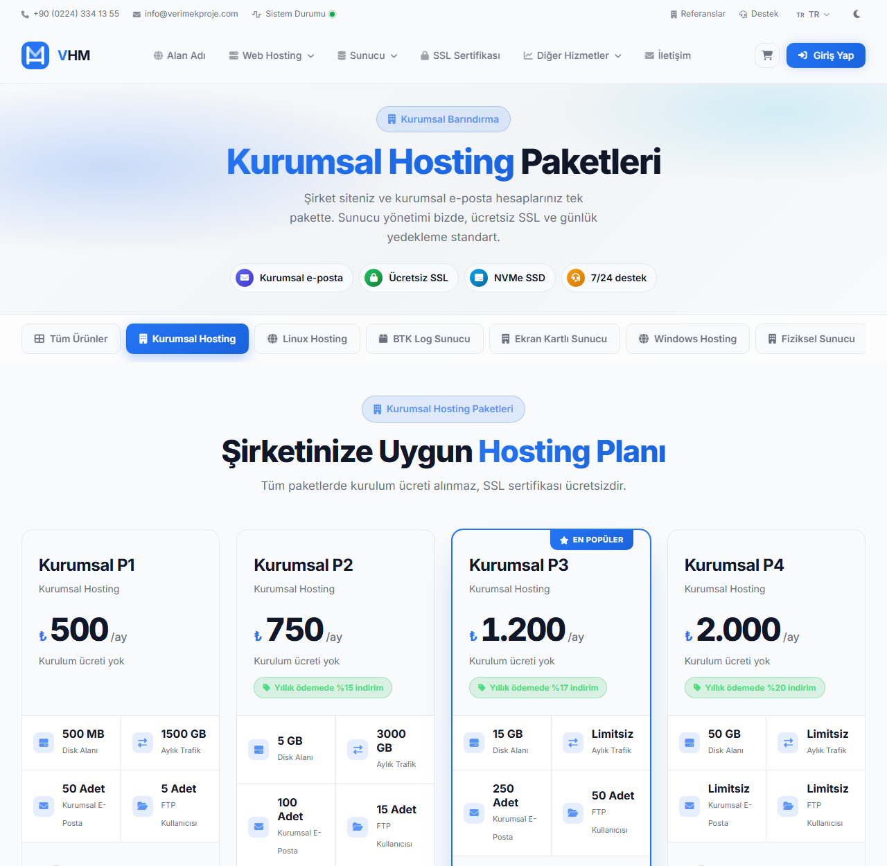
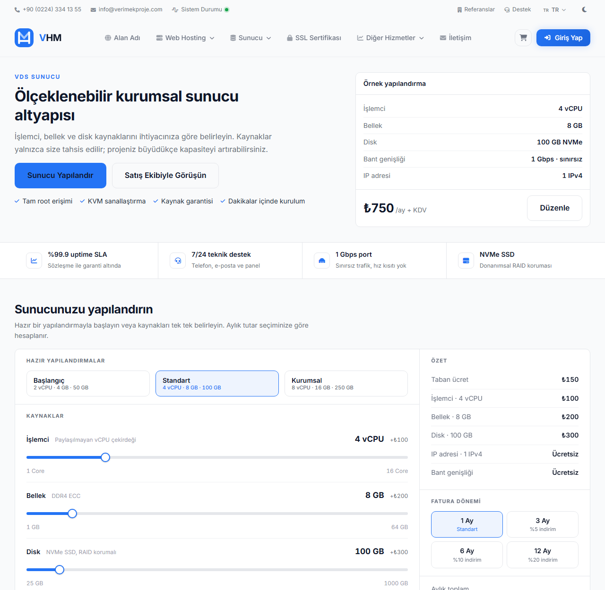

<div align="center">


# VHM

**Hosting ve veri merkezi yönetim paneli**

Hosting, sunucu, alan adı ve SSL satışını tek yerden yöneten;
vitrin, müşteri portalı ve yönetim arayüzüyle gelen sipariş ve faturalandırma sistemi.

<sub>
  PHP 8.1 &nbsp;·&nbsp; MySQL / MariaDB &nbsp;·&nbsp; Çerçevesiz &nbsp;·&nbsp; Derleme adımı yok
</sub>

</div>

<br>

<div align="center">
  
</div>

<br>

---

## İçindekiler

| | |
|---|---|
| [Ne işe yarar](#ne-i̇şe-yarar) | Sistemin kapsamı ve üç ana bölümü |
| [Ekran görüntüleri](#ekran-görüntüleri) | Vitrin sayfalarından örnekler |
| [Özellikler](#özellikler) | Vitrin, portal, panel ve entegrasyonlar |
| [Nasıl çalışır](#nasıl-çalışır) | Sayfa üretimi, paket kartları, tema |
| [Kurulum](#kurulum) | Beş adımda ayağa kaldırma |
| [Dizin yapısı](#dizin-yapısı) | Dosyalar nerede |
| [Yapılandırma](#yapılandırma) | Hangi ayar nereden |
| [Güvenlik](#güvenlik) | Depoya ne girmez, kurulumdan sonra ne yapılır |

---

## Ne işe yarar

Bir hosting sağlayıcısının satıştan faturaya kadar olan işini tek yerde toplar.

<table>
<tr>
<td width="33%" valign="top">

### Vitrin

Hizmet sayfaları, paket karşılaştırma, sepet ve sipariş akışı.
Her hizmet grubunun kendi sayfa tasarımı var; paketler veritabanından okunur.

</td>
<td width="33%" valign="top">

### Müşteri portalı

Hizmetler ve yenileme, fatura görüntüleme ve ödeme, destek talepleri,
alan adı yönetimi, bakiye ve işlem geçmişi.

</td>
<td width="33%" valign="top">

### Yönetim paneli

Ürün kataloğu, sipariş ve fatura akışı, müşteri kayıtları, sunucu tanımları,
menü, dil ve çeviri yönetimi.

</td>
</tr>
</table>

Arayüz Türkçedir. Çok dilli altyapı (TR / EN / AR) yönetim panelinden düzenlenir.

---

## Ekran görüntüleri

<table>
<tr>
<td width="50%" align="center" valign="top">
  <a href="docs/screenshots/01-anasayfa.png">
    
  </a>
  <p><b>Ana sayfa</b><br>
  <sub>Veri merkezi anlatımı, tıklanabilir<br>izometrik tesis çizimi</sub></p>
</td>
<td width="50%" align="center" valign="top">
  <a href="docs/screenshots/02-linux-hosting.png">
    
  </a>
  <p><b>Linux Hosting</b><br>
  <sub>cPanel, LiteSpeed ve JetBackup<br>üzerinden paket karşılaştırması</sub></p>
</td>
</tr>
<tr>
<td width="50%" align="center" valign="top">
  <a href="docs/screenshots/03-kurumsal-hosting.png">
    
  </a>
  <p><b>Kurumsal Hosting</b><br>
  <sub>Kurumsal e-posta ve FTP kullanıcısı<br>odaklı yüksek kaynaklı paketler</sub></p>
</td>
<td width="50%" align="center" valign="top">
  <a href="docs/screenshots/04-vds.png">
    
  </a>
  <p><b>VDS Sunucu</b><br>
  <sub>Kaydırıcıyla kaynak seçimi,<br>anlık fiyat hesabı</sub></p>
</td>
</tr>
</table>

<div align="center"><sub>Görsele tıklayarak tam boyutta açabilirsiniz.</sub></div>

---

## Özellikler

### Vitrin ve satış

| | |
|---|---|
| **Hizmet grubuna özel sayfa** | Linux, Windows, WordPress, Kurumsal, Arşiv Hosting, Web Site Builder, SSL, VDS, fiziksel sunucu, BTK log sunucu, hotspot — her biri kendi tasarımıyla |
| **Veritabanından paket kartı** | Ürün açıklaması ayrıştırılır: ilk satırlar teknik özet kutucuğuna, kalanı özellik listesine |
| **Sipariş yapılandırma** | Ödeme dönemi, ek seçenekler, alan adı adımı |
| **Tahsilat** | PayTR sanal POS, banka havalesi, müşteri bakiyesi |

### Adres seçimli keşif talebi

Hotspot ve internet hizmeti için yerinde keşif formu. İl, ilçe ve mahalle listesi
[TurkiyeAPI](https://api.turkiyeapi.dev) üzerinden gelir; ilçe elle yazılmaz,
mahallenin resmî ilçesi API'den okunur ve diske önbelleklenir. Sokak listesi
yönetim panelinden girilir — boşsa alan serbest metne düşer, dolduğunda açılır
menüye döner. Form CSRF belirteci, gizli bot tuzağı alanı ve gönderim aralığı
sınırıyla korunur; mahalle ve sokak adı istemciden gelen metinden değil, kimlik
üzerinden veritabanından çözülür.

### Çok dilli yapı

`includes/Lang.php` sözlüğü veritabanından okur ve eksik anahtarları istek
sonunda varsayılan dile ekler — yeni metin eklerken çeviri tablosunu elle
doldurmak gerekmez. Arapça için RTL desteği vardır; telefon ve fiyat alanları
`unicode-bidi: isolate` ile korunur, aksi hâlde numaralar ters sırada görünür.

### Entegrasyonlar

| Alan | Sağlayıcı |
|---|---|
| Sanallaştırma | VMware ESXi (SOAP) — sanal sunucu oluşturma ve yönetimi |
| Alan adı | Sağlayıcı API'si üzerinden sorgulama, kayıt ve transfer |
| Ödeme | PayTR sanal POS, banka havalesi (manuel onay) |
| SMS | NetGSM — sipariş ve fatura bildirimleri |
| Adres | TurkiyeAPI — il / ilçe / mahalle |

---

## Nasıl çalışır

**Sayfa üretimi.** Şablon motoru yoktur; sayfalar doğrudan PHP ile üretilir.
`store.php` içinde her hizmet grubu kendi dalında kendi tasarımını taşır, ortak
bileşenleri `theme/includes/` altından alır.

**Paket kartları.** Kartlardaki teknik özet elle yazılmaz. Ürün açıklamasındaki
satırlar sayfanın kendi eşleşme kurallarıyla ayrıştırılır; örneğin
`24 Çekirdek İşlemci` satırı İşlemci kutucuğuna `24 Çekirdek` olarak düşer,
kalan satırlar özellik listesine gider. Yeni paket eklemek için kod değişmez.

**Tema.** Açık ve koyu tema `[data-theme]` niteliği ve CSS değişkenleriyle
yönetilir. Renk, boşluk, yarıçap ve tipografi tek yerde tanımlı token'lardan
gelir; sabit renk değeri kullanılmaz.

**Görseller.** Donanım ve tesis çizimleri (Dell R730, EMC VNX7600, veri merkezi
kesiti) SVG olarak kodda üretilir — harici görsel dosyası gerekmez, her
çözünürlükte keskin kalır.

---

## Kurulum

### Gereksinimler

- **PHP 8.1+** — `pdo_mysql`, `mbstring`, `curl`, `openssl`, `json`
- **MySQL 5.7+** veya **MariaDB 10.4+**
- **Apache** (`mod_rewrite`) veya **Nginx**

### Adımlar

<details open>
<summary><b>1 · Dosyaları alın</b></summary>

```bash
git clone https://github.com/Sem-h/VHMWM.git
cd VHMWM
```
</details>

<details open>
<summary><b>2 · Veritabanını kurun</b></summary>

```bash
mysql -u root -e "CREATE DATABASE whmvm CHARACTER SET utf8mb4 COLLATE utf8mb4_unicode_ci;"
mysql -u root whmvm < install/whmvm-kurulum.sql
```

Bu dosya **yalnızca tablo yapısını** kurar — 57 tablo, sıfır satır veri.
Ürün, ayar, çeviri ya da kimlik bilgisi içermez. Uygulamanın çalışması için
gereken varsayılanlar (e-posta şablonları, menü) sonraki adımdaki kurulum
sihirbazı tarafından oluşturulur.

Şemayı değiştirdiğinizde (yeni tablo veya sütun) dosyayı yeniden üretin:

```bash
php install/sema-disari-aktar.php
```
</details>

<details open>
<summary><b>3 · Yapılandırmayı hazırlayın</b></summary>

```bash
cp config/config.sample.php   config/config.php
cp config/ip-config.sample.php config/ip-config.php
```

`config/config.php` içinde veritabanı bilgilerini ve şifreleme anahtarını doldurun:

```php
define('DB_HOST', 'localhost');
define('DB_NAME', 'whmvm');
define('DB_USER', 'whmvm_user');
define('DB_PASS', '…');

// Her kurulumda yeniden üretilmeli
define('ENCRYPTION_KEY', '…');
```

Anahtar üretmek için:

```bash
php -r "echo bin2hex(random_bytes(16)), PHP_EOL;"
```

Her iki dosya da `.gitignore` kapsamındadır, depoya gitmez.
</details>

<details open>
<summary><b>4 · Yazma izinlerini verin</b></summary>

```bash
chmod -R 775 uploads storage
```
</details>

<details open>
<summary><b>5 · Yönetici hesabını açın</b></summary>

Tarayıcıdan `install/install.php` adresine gidin, yönetici hesabını oluşturun.
Ardından **`install/` klasörünü silin** veya web erişimine kapatın.
</details>

---

## Dizin yapısı

```
├── admin/          Yönetim paneli — ürün, sipariş, fatura, müşteri, ayarlar
├── client/         Müşteri portalı — hizmetler, faturalar, destek, alan adları
├── api/            Uç noktalar (keşif talebi)
├── includes/       Çekirdek sınıflar
│   ├── Database.php      PDO sarmalayıcı, hazırlanmış sorgular
│   ├── Lang.php          Çok dil, eksik anahtar yakalama
│   ├── Settings.php      Ayar okuma/yazma
│   ├── Mail.php          E-posta şablonları ve gönderim
│   ├── TurkiyeAdres.php  İl/ilçe/mahalle, önbellekli
│   └── SokakMetni.php    PTT sokak listesi ayrıştırma
├── theme/          Vitrin teması — header, footer, CSS, logo
├── modules/        Eklentiler — paytr, netgsm, bank-transfer, seo-manager
├── config/         Yapılandırma (gerçek dosyalar depoda değildir)
├── install/        Şema ve kurulum betiği
├── storage/        Çalışma zamanı önbelleği
└── docs/           Belgeler ve ekran görüntüleri
```

Vitrin sayfaları kök dizindedir: `index.php`, `store.php`, `ssl.php`, `vds.php`,
`domain.php`, `contact.php`, `bursa-hotspot-hizmeti.php` ve diğer hizmet sayfaları.

---

## Yapılandırma

| Ne | Nerede | Not |
|---|---|---|
| Veritabanı, şifreleme anahtarı | `config/config.php` | Depoya girmez |
| Dış adres / alan adı | `config/ip-config.php` | Depoya girmez |
| Şirket bilgileri, SMTP | Panel → Ayarlar | `settings` tablosu |
| Banka hesapları | Panel → Banka Hesapları | `bank_accounts` tablosu |
| Menü | Panel → Menü Yönetimi | `menu_items` tablosu |
| Diller ve çeviriler | Panel → Dil Yönetimi | `languages`, `translations` |
| Hizmet bölgeleri | Panel → Hizmet Bölgeleri | İlçe API'den, sokak elle |
| Ürün ve paketler | Panel → Ürünler | `products`, `product_groups` |

---

## Güvenlik

**Depoya girmeyenler** — `.gitignore` ile dışarıda tutulur:

- `config/config.php`, `config/ip-config.php` — veritabanı bilgileri, şifreleme
  anahtarı, sunucu adresi
- **Veritabanı verisi** — depoya yalnızca şema (tablo, sütun, indeks) girer.
  Satır verisi hiçbir biçimde eklenmez. Dökümler hex kodlanmış olabilir ve
  metin aramasına takılmaz; bu yüzden dosya türü üzerinden engellenir
- Veritabanı dökümleri, `.bson` ve `.zip` çıktıları
- Paketlenmiş `.zip` çıktıları — sürüm paketi Releases üzerinden dağıtılmalı
- Yedek dosyaları (`*.bak`, `*.backup`), çalıştırma betikleri (`*.bat`, `*.ps1`)
- `README.md` dışındaki bütün `.md` dosyaları

**Kod tarafında:**

- Parolalar `password_hash()` ile saklanır
- Bütün sorgular PDO ile parametrelidir
- Keşif talebi formu: oturum tabanlı CSRF belirteci, gizli bot tuzağı alanı,
  gönderim aralığı sınırı, sunucu tarafı doğrulama

**Kurulumdan sonra:**

1. `ENCRYPTION_KEY` değerini yeniden üretin — örnek değeri kullanmayın
2. `install/` klasörünü silin veya web erişimine kapatın
3. SMTP ve ödeme sağlayıcı bilgilerini panelden girin

---

<div align="center">
<sub>Bu depo özel kullanım içindir.</sub>
</div>
